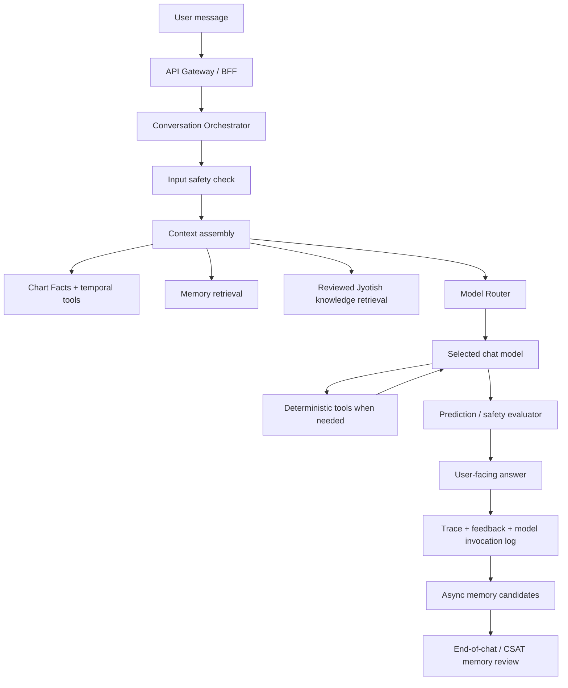

# System Design v0.2

Project: Exponential - Jyotish Companion  
Status: Draft v0.2  
Date: 2026-06-29  
Companion PRD: `docs/10-product/prd-v0.2.md`  
Source of truth: Git repository first; Drive/HTML/PDF are exports.

## 0. Scope of This Revision

The v0.1 architecture remains directionally correct:

- Keep deterministic astrology computation separate from LLM conversation.
- Treat the computed chart as ground truth.
- Use an orchestrator plus LLM gateway for runtime conversation.
- Store memory, feedback, traces, prompts, and generated profiles as versioned artifacts.

This v0.2 design makes the surgical changes from the PM review explicit:

- Model/provider choices are routed through a model router.
- Chat models and embedding models are independent decisions.
- Manual memory review happens at end-of-chat/CSAT, not during live chat.
- Jyotish knowledge retrieval is reviewed and labeled, but not positive-only.
- Difficult predictions use both prompt behavior and evaluator checks.
- Future analyses use generic versioned analysis runs rather than feature-specific tables.

## 1. Architecture Principles

### 1.1 Two Kinds of Intelligence

Deterministic intelligence:

- Computes charts, dashas, vargas, yogas, doshas, strengths, temporal context, compatibility scores, and other formal outputs.
- Runs through code, rule engines, or validated astrology APIs.
- Produces structured facts and immutable outputs.

Generative intelligence:

- Explains, synthesizes, converses, personalizes, and extracts memory candidates.
- Runs through the model router.
- Must stay grounded in deterministic facts, reviewed doctrine, and user-stated memories.

Golden rule: the LLM may interpret chart facts; it must not invent chart facts.

## 2. High-Level Runtime Flow

## 3. Model Router

All model calls go through `model_routes`.

Routes:

- `runtime_astrologer`
- `profile_synthesizer`
- `memory_extractor`
- `prediction_evaluator`
- `embedding_memory`
- `embedding_knowledge`
- `safety_classifier`

Each route can have:

- Primary model
- Fallback models
- Evaluator model
- Route-specific config
- Status: active, shadow, disabled, deprecated

This lets the product validate open-source/open-weight Chinese models, hosted models, local models, and future models without rewriting product logic or database tables.

## 4. Provider-Neutral Embeddings

Embeddings are stored in `text_embeddings`, not directly on domain tables.

Why:

- Provider D5 remains open.
- Different embedding models produce different dimensions.
- A `vector(1536)` field on `memories` or `jyotish_knowledge` silently commits the system to an OpenAI-shaped embedder.

Design:

- `model_catalog.dimensions` records the embedding model dimension.
- `text_embeddings.dimensions` records the dimension used for each vector.
- `CHECK (vector_dims(embedding) = dimensions)` catches mismatches.
- Model-specific pgvector indexes are added only after the embedding model is selected.
- Re-embedding is a first-class migration path when providers change.

## 5. Memory UX

Memory modes remain:

- Off
- Manual
- Auto

The real default is Manual.

Manual flow:

1. The memory extractor runs after or near the end of the session.
2. It writes candidate memories to `memory_candidates`.
3. During CSAT/session review, the user sees Save / Edit / Discard controls.
4. Only approved candidates become `memory_facts`.
5. Saved facts can later receive embeddings through `text_embeddings`.

This keeps the chat emotionally smooth while preserving user control.

## 6. Jyotish Knowledge Retrieval

The retrieval posture is not "only positive chunks."

The retrieval posture is:

- Store sources with provenance.
- Break sources into reviewable chunks.
- Label chunks for topic, source, confidence, safety labels, and delivery policy.
- Allow reviewed challenging/negative material when relevant.
- Block or transform prohibited delivery: death prediction, terminal diagnosis, self-harm framing, unavoidable doom, legal/financial/medical overreach, and coercive fear-selling.

Implementation:

- `knowledge_sources` stores source metadata.
- `knowledge_chunks` stores reviewed chunks and labels.
- `reviewed_for_user_retrieval` gates user-facing retrieval.
- `delivery_policy` controls whether content is allowed normally, allowed with caution, must be transformed, stays internal, or is blocked.

## 7. Responsible Prediction Delivery

Use both:

- Prompt-level behavior in `docs/40-ai-quality/prompts/astrologer-persona-v0.2.md`.
- Evaluator checks in `docs/40-ai-quality/prompts/prediction-evaluator-v0.2.md` and `prediction_evaluations`.

Why both:

- The prompt teaches the astrologer how to speak naturally.
- The evaluator checks whether the actual output stayed grounded, safe, and non-fatalistic.

The evaluator should repair delivery by default, not erase legitimate caution. Negative readings are allowed when grounded and responsibly framed.

## 8. Future Analyses and Pivot-Friendly Design

Marriage matching is an example, not the schema center.

The base model is:

- `birth_profiles`: saved people/subjects.
- `charts`: immutable computed chart snapshots.
- `analysis_types`: catalog of analyses.
- `analysis_runs`: one versioned computed run.
- `analysis_run_subjects`: one or more subjects linked to a run.

This supports:

- Natal profile
- Compatibility/Kundali matching
- Family chart analysis
- Muhurta
- Career timing
- Specialized paid reports
- Future pivots into other advisory products

The LLM can narrate an analysis, but deterministic results and scores come from engines or reviewed rule outputs.

## 9. Versioning and Observability

Every model invocation records:

- Route key
- Provider/model/version
- Prompt version
- Token usage
- Latency
- Cache hit
- Cost estimate
- Fallback status
- Trace ID

Every generated profile or analysis records:

- Chart schema version
- Algorithm version
- Prompt version
- Persona version
- Model/provider version
- Safety policy version
- Supersession link when regenerated

This supports persona upgrades and future use-case-specific versions without mutating history.

## 10. Evaluation Harness

The initial eval baseline lives under `docs/40-ai-quality/evals/`.

Use it to validate:

- Open-source/open-weight Chinese model candidates.
- Hosted model fallbacks.
- Runtime astrologer grounding and tool use.
- Prediction delivery quality.
- Evaluator behavior.
- Manual memory extraction.

Models can run in shadow mode before becoming active. User-facing prediction routes should not become active unless groundedness, responsible prediction, and safety gates pass.

## 11. Data Contracts

The schema base is `docs/30-data-and-schema/schema-v0.2-base.sql`.

Core tables added or emphasized in v0.2:

- `model_catalog`
- `model_routes`
- `model_eval_runs`
- `model_invocations`
- `memory_candidates`
- `knowledge_sources`
- `knowledge_chunks`
- `text_embeddings`
- `analysis_types`
- `analysis_runs`
- `analysis_run_subjects`
- `prediction_evaluations`
- `interpretive_profiles`

## 12. What Did Not Change

The following v0.1 architectural choices remain valid:

- Chart computation is deterministic and cached/immutable.
- Runtime temporal context is computed at conversation time.
- The Chart Facts Sheet is authoritative grounding.
- The Interpretive Profile is generated once per chart/persona/model version.
- The Conversation Orchestrator assembles context and calls tools.
- Safety wraps model behavior outside the persona prompt.
- Heavy work runs async where possible.
- Git is the source of truth; Drive contains exports.

## 13. Remaining Open Decisions

- D1: astrology engine build/buy/hybrid.
- D2: app stack and mobile path.
- D4: launch languages.
- D5: active model and embedding provider selections.
- D6: monetization model.
- D7: one continuous chat versus multiple threads.
- D8: V1 chart depth.
- D9: unknown birth time handling.
- D10: prediction policy thresholds.
- D11: knowledge review workflow and reviewer ownership.

## 14. Implementation Note

Do not build feature-specific schema around the first future use case. Implement the generic base first, then add analysis-specific algorithms, UI, and reports as versioned extensions.
